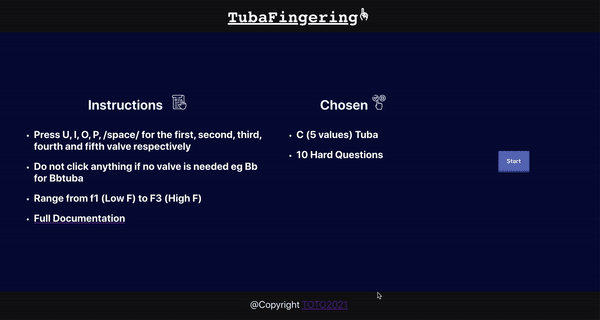

# Tuba Fingering
Link: https://tubafingering.netlify.app
<br/>Practice Tuba anywhere
<br/>Author: Issac To
<hr/>

## 1. 💻 Demo
| Landing         | Demo           | 
| ------------- |:-------------:| 
|    |  |

<br/>

1. Choose a key, valve, level of difficulty (time allowed for each question), and number of questions

2. Familiarize yourself with the designated fingering
<br/>https://tubafingering.netlify.app/documentationPage

3. Play 
* Press U, I, O, P, /space/ for the first, second, third, fourth and fifth valve respectively
* Do not click anything if no valve is needed eg Bb for Bbtuba

! You could use keyboard entirely to navigate on this website;)

## 2. 📌 Structure
* React

## 3. 🏃 Run the program

```javascript 
npm install
npm start
```

Install and run the program on localhost:3000

